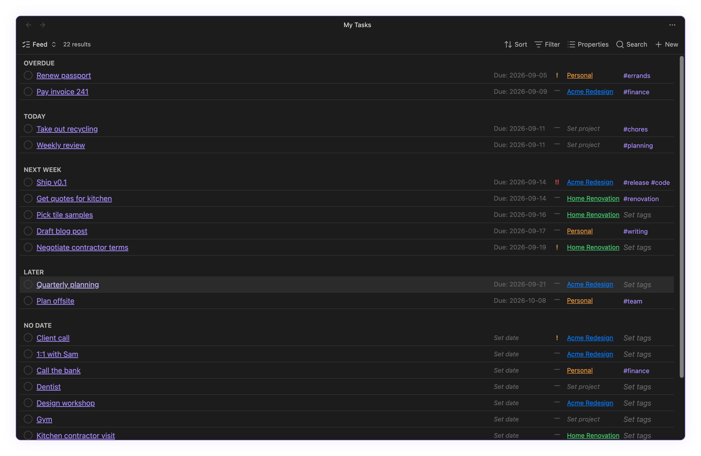
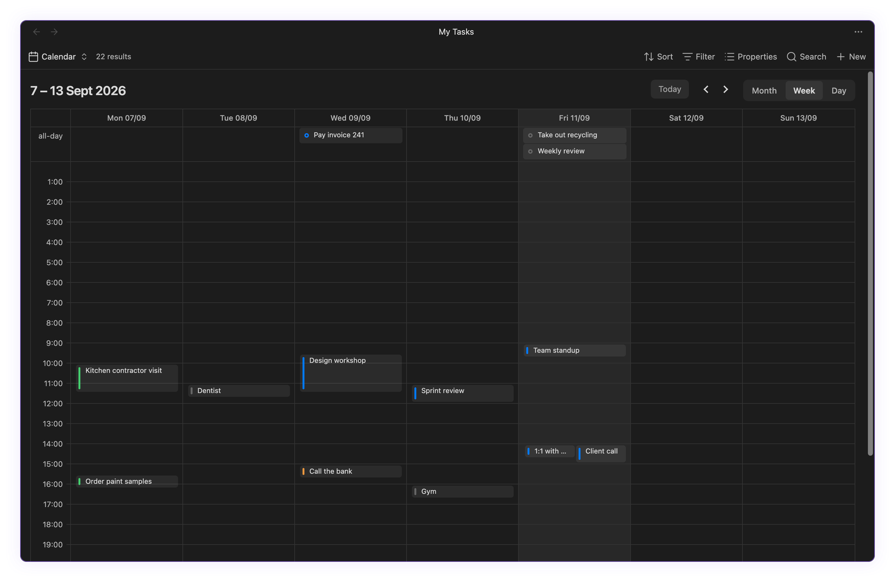
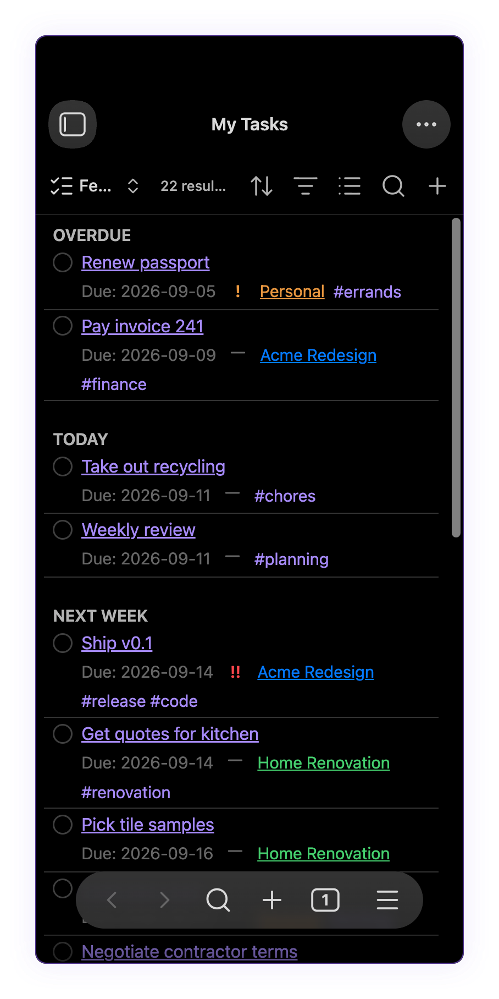
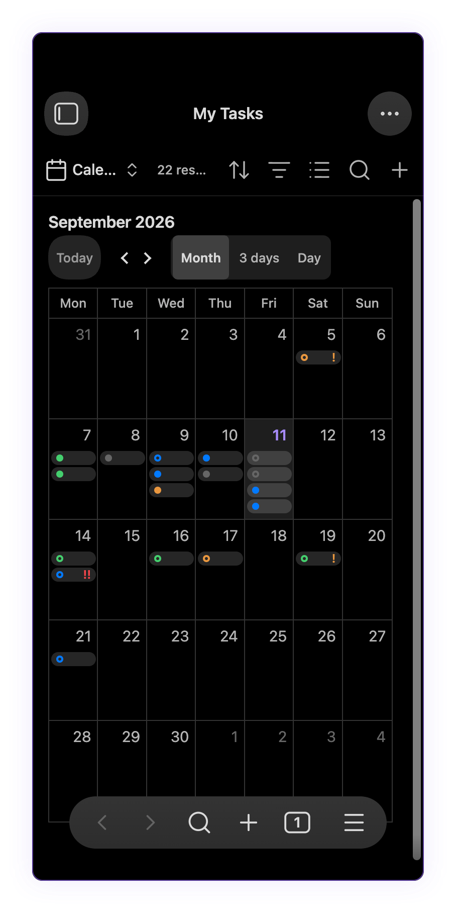

# Obtask

[Install](#install) · [Quick start](#quick-start) · [Docs](#docs) · [Development](#development)

[](https://github.com/dgopsq/obtasks/actions/workflows/ci.yml)
[](https://github.com/dgopsq/obtasks/releases)
[](LICENSE)

<table align="center">
  <tr>
    <td align="center" width="50%"></td>
    <td align="center" width="50%"></td>
  </tr>
  <tr>
    <td align="center"><sub>Feed</sub></td>
    <td align="center"><sub>Calendar</sub></td>
  </tr>
  <tr>
    <td align="center"></td>
    <td align="center"></td>
  </tr>
  <tr>
    <td align="center"><sub>Feed on mobile</sub></td>
    <td align="center"><sub>Calendar on mobile</sub></td>
  </tr>
</table>

**Your notes are your tasks.** Frontmatter in, feed and calendar out, built on Obsidian Bases.

## Why

One markdown note is one task. Every field (status, due date, priority, project, recurrence) is
an ordinary frontmatter property, not a hidden database or a bespoke query language. The feed and
calendar are just Bases views, so Bases' own filters, sorting, and properties toolbar work on them
exactly like they work on any other view you build. There is nothing to migrate to and nothing to
migrate away from: the notes are still just notes.

## Features

- **Feed** buckets tasks into Overdue, Today, This week, Next week, Later, and No date. See
  [feed buckets](docs/DOMAIN-MODEL.md#feed-buckets).
- **Calendar** month, week, and day views. Drag or resize an event to reschedule, click an empty
  slot to create a task, undo or redo a reschedule from the command palette.
- **Recurrence** is RRULE-based; completing an occurrence spawns the next one as a new note. See
  [recurrence semantics](docs/DOMAIN-MODEL.md#recurrence-semantics).
- **Statuses** are two kinds, open and done, toggled from the feed's status circle, the file menu,
  or the task panel.
- **Priorities** are normal, high, or urgent.
- **Projects** are a wikilink to a project note; that note's `color` property colours the task in
  the feed and on the calendar.
- **Task panel** is a sidebar form for the active note, with a command for every field.
- **Mobile** ready: no desktop-only APIs, long-press to drag events on the calendar.
- **Your property names** every frontmatter key is renameable in settings, not just the ones shown
  above.
- **Commands** for everything above, plus convert note to task, create/open the tasks base, and
  undo/redo a reschedule, all in the command palette.

## Settings

- **Task folder**, **tasks base path**: where new task notes and the generated `.base` file live.
- **New task filename template**, **spawn filename template**: filename for a new or spawned task
  note, supporting `{{title}}` and (spawn only) `{{due}}`.
- **Week starts on**: which day the feed's this week / next week buckets split on.
- **Property keys**: every frontmatter key above, plus the marker key/value that identifies a note
  as a task, individually renameable.

## Install

### Community plugins

Not yet listed; a submission is in progress.

### Manual

Download `main.js`, `manifest.json`, and `styles.css` from the
[latest release](https://github.com/dgopsq/obtasks/releases/latest) into
`<vault>/.obsidian/plugins/obtask/`, then reload Obsidian and enable Obtask in Settings.

Obtask requires Obsidian 1.13.0 or later (Bases).

To update, repeat the manual steps above with the new release's files.

## Quick start

1. Run the **Create tasks base** command. It creates `Tasks.base` with a feed and a calendar view.
2. Run **Create task** to add a task note.
3. Set a due date, from the task panel or the **Set due date…** command.
4. Open `Tasks.base` and switch between the feed and calendar views from Bases' view switcher.
5. Complete it: click the status circle on its feed row.

A task note's frontmatter, with the default property keys:

```yaml
---
type: task
status: todo
due: 2026-09-15
scheduled: 2026-09-14
priority: high
project: "[[Website relaunch]]"
tags: [marketing]
repeat: FREQ=WEEKLY;BYDAY=MO
---
```

## Docs

- [Architecture](docs/ARCHITECTURE.md): layers, data flow, ports, and the composition root.
- [Domain model](docs/DOMAIN-MODEL.md): frontmatter schema, statuses, recurrence, feed buckets.
- [Conventions](docs/CONVENTIONS.md): TypeScript, DOM, Obsidian API, and testing rules.
- [ADRs](docs/adr/README.md): architecture decision records, indexed by number.
- [Roadmap](docs/ROADMAP.md): milestones, what shipped, and what's left before release.

## Development

```bash
pnpm install
pnpm dev         # esbuild watch build
pnpm check       # typecheck + lint + test + build
pnpm test        # vitest run
pnpm test:e2e    # full e2e suite (builds first)
pnpm wt feat/<name> # new worktree branched off main, deps installed
```

For a fast e2e debug loop, filter to one spec and one test name:
`E2E_GREP="<pattern>" pnpm test:e2e --spec <substring>`.

> Working with an AI agent? Start from `AGENTS.md`.

## License

[MIT](LICENSE) © Diego Pasquali
